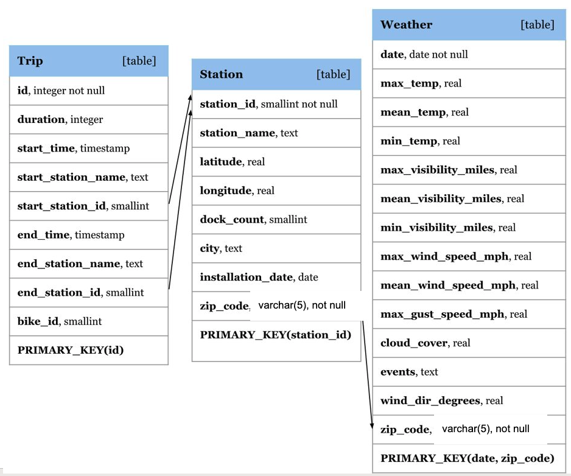

# 50.043 Cohort class 3


## Learning Outcomes

By the end of this unit you should be able to use SQL to

1. create and alter databases and tables
2. create and alter table constraints
3. inject data into tables
4. retrieve data from tables

## Recap SQL

To create a database, we may use the following SQL statement.

```sql
create database if not exists db_name;
```

To drop a database

```sql
drop database if exists db_name;
```

To create tables

```sql
create table if not exists my_db.article (
    id char(100) primary key,
    name char(100)
);
create table if not exists  my_db.book (
    id char(100) primary key,
    name char(100)
);

create table if not exists my_db.publisher (
    id char(100) primary key,
    name char(100)
);

create table if not exists my_db.publish (
    article_id char(100),
    book_id char(100),
    publisher_id char(100),
    primary key (article_id, book_id),
    foreign key (article_id) references my_db.article(id),
    foreign key (book_id) references my_db.book(id),
    foreign key (publisher_id) references my_db.publisher(id)
);
```

To inject values, we use the insert statement.

```sql
insert into my_db.article (id, name) values 
('a1', 'article 1'),
('a2', 'article 2'); 

insert into my_db.book (id, name) values 
('b1', 'book 1'),
('b2', 'book 2');

insert into my_db.publisher (id, name) values
('p1', 'publisher 1'),
('p2', 'publisher 2');

insert into my_db.publish (article_id, book_id, publisher_id) values
('a1', 'b1', 'p1'),
('a2', 'b1', 'p1'),
('a1', 'b2', 'p2');
```


To retrieve data stored in a table, we use the select statement.

```sql
select article_id, book_id, publisher_id  from my_db.publish;
```


When querying multiple table, we would use the inner join.

```sql
select * from my_db.publish p 
inner join my_db.article a 
on p.article_id = a.id;
```

When filtering is required, we use where-clause with a predicate.

```sql
select a.name from my_db.publish p 
inner join my_db.article a 
on p.article_id = a.id
where p.publisher_id = 'p1';
```

And remember self-join, aggregation, order-by and nested query.

## Setup 

### Option 1: Using AWS Educate

Use AWS educate and launch an instance using the ami given in `create_EC2.py` in week 1 lab. 


This is an image pre-installed with ubuntu and mysql 8. The data folder needed in this cohort class is in `/home/ubuntu/lab3_sql`.

### Option 2: Using your own machine

Make sure you have MySQL installed. 

1. If you are using ubuntu, run the following commands to download the data file `lab3_sql.tgz`.

```sh
sudo apt install python3-pip
sudo pip install gdown​
gdown "https://drive.google.com/uc?id=1g_4t-hf5PQIDpEdm5jhC5lnDxAWSnHSw"
```
2. If you are using Mac

```sh
brew install python3-pip
pip3 install install gdown
gdown "https://drive.google.com/uc?id=1g_4t-hf5PQIDpEdm5jhC5lnDxAWSnHSw"
```

3. Alternative, you can manually download that file https://drive.google.com/uc?id=1g_4t-hf5PQIDpEdm5jhC5lnDxAWSnHSw using browser.


## Exercise 0 - create database and tables

In MySQL, create a database with the following table.



You can make use of the .sql files in lab3_sql folder. There are two files.
1. `setup_v57.sql` For MySQL 5
2. `setup_v8.sql`  For MySQL 8

You can load the data 

```sql
create database cc3;
use cc3;
source /home/ubuntu/lab3_sql/setup_v8.sql
```

### Trouble shooting 

If you encounter the following error when loading the data

```
ERROR 1290 (HY000): The MySQL server is running with the --secure-file-priv option 
so it cannot execute this statement
```

Append the following line to the file 

* Ubuntu: `/etc/mysql/mysql.conf.d/mysqld.cnf`
* MacOS X (brew): `/usr/local/etc/my.cnf`

```
secure-file-priv = "<folder where the CSV files are located>"
```

e.g.

```
secure-file-priv = "/tmp/sql/"
```

Then restart mysql service. Make sure that the above folder is accessible by MySQL client.


## Exercise 1

Count the number of cities (no duplicates)​

## Exercise 2

Count the number of stations in each city. Output the city name, and station count.​

## Exercise 3 

Count the number of self-loop trips. A self-loop trip is one that starts and ends at the same station.


## Optional

For the next few exercises, you may want to create a temporary table to better manage your nested queries.

```sql
create temporary table <name> <SQL query>​
```

Temporary table will be removed automatically by the DBMS when not in-use.

## Exercise 4

Print the ratio of self-loop trips over all trips..

## Exercise 5

Find the most popular city, in terms of percentage of trips belonging to the city

## Exercise 6

Find all the bikes (their bike_id) that have been to more than 1 city. A bike has been to a city if its start or end station of one of its trips is in this city.

## Exercise 7

List the bikes (their bike_id) that have never been to Japantown station.​